# 📊 PlugWay ETL - Diagramas de Arquitetura e Regras de Negócio

Este documento contém diagramas Mermaid que descrevem a arquitetura, fluxos de execução e regras de negócio do PlugWay ETL.

---

## 🏗️ 1. Arquitetura em Camadas

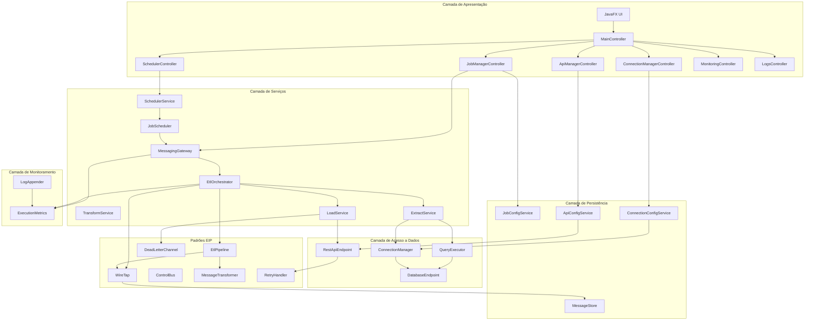

---

## 🔄 2. Fluxo de Execução ETL (Sequência)

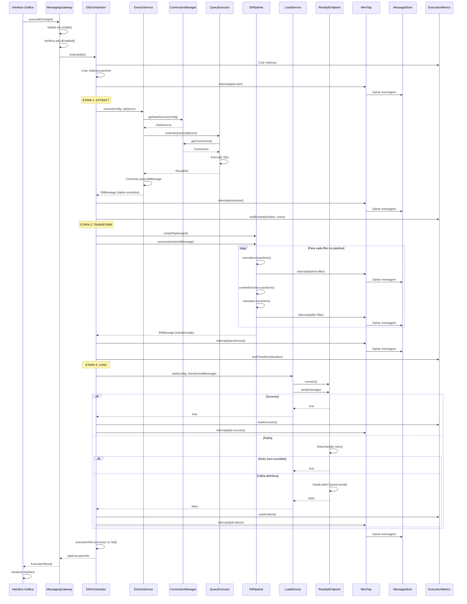

---

## 🧩 3. Diagrama de Componentes

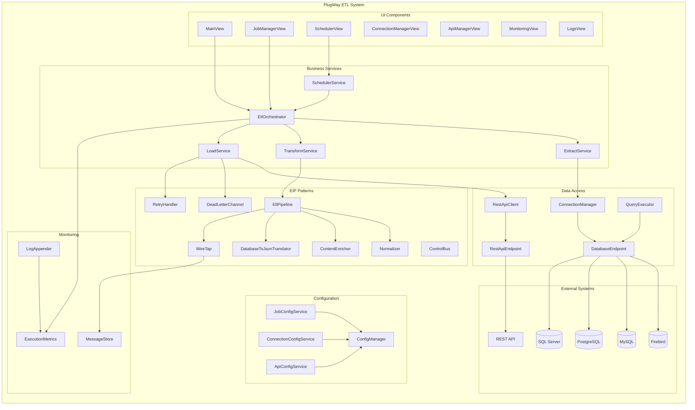

---

## 📦 4. Modelo de Dados (Entidades Principais)

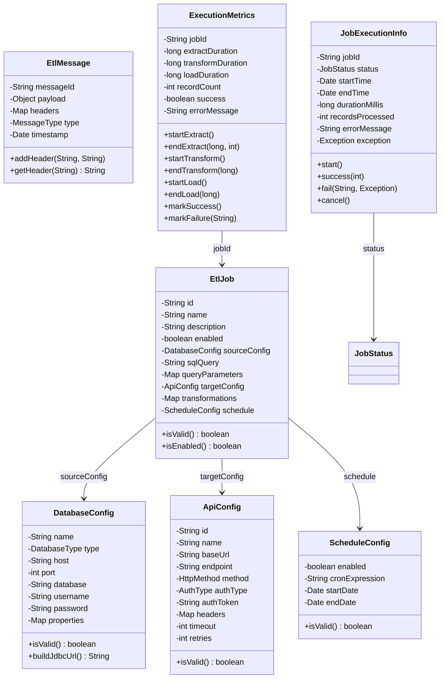

---

## 🔀 5. Pipeline de Transformação (Pipes and Filters)

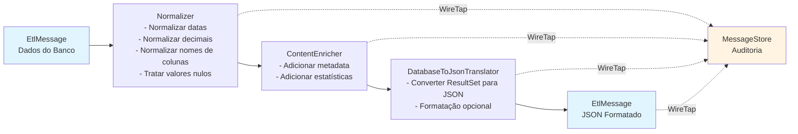

---

## 🎯 6. Estados do Job ETL

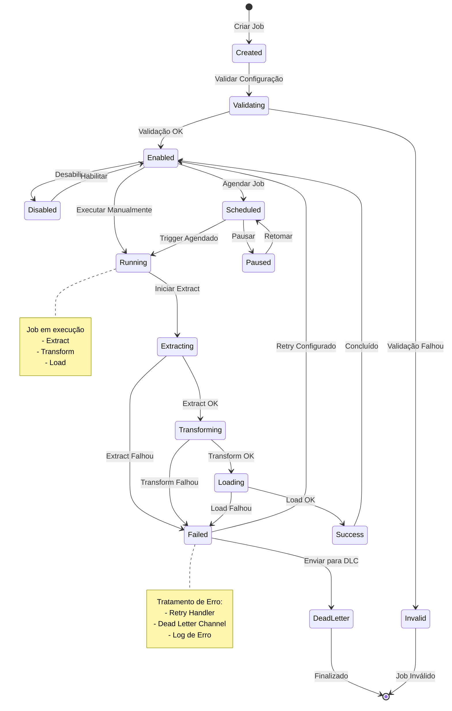

---

## 🔐 7. Regras de Negócio - Validação de Job

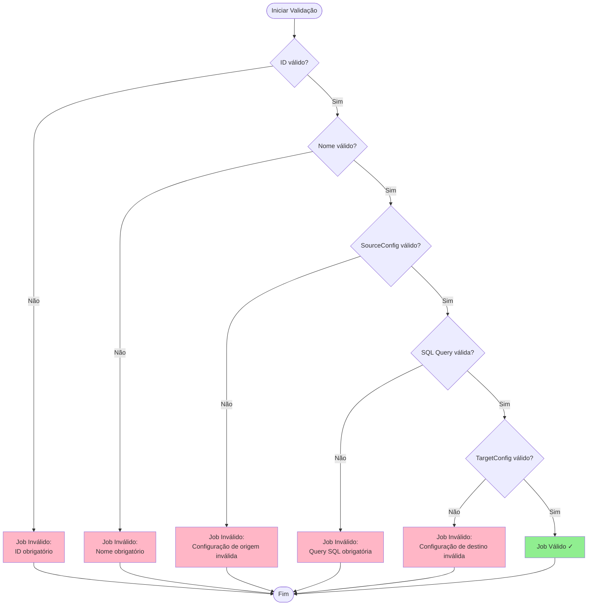

---

## 🔄 8. Regras de Negócio - Fluxo de Execução

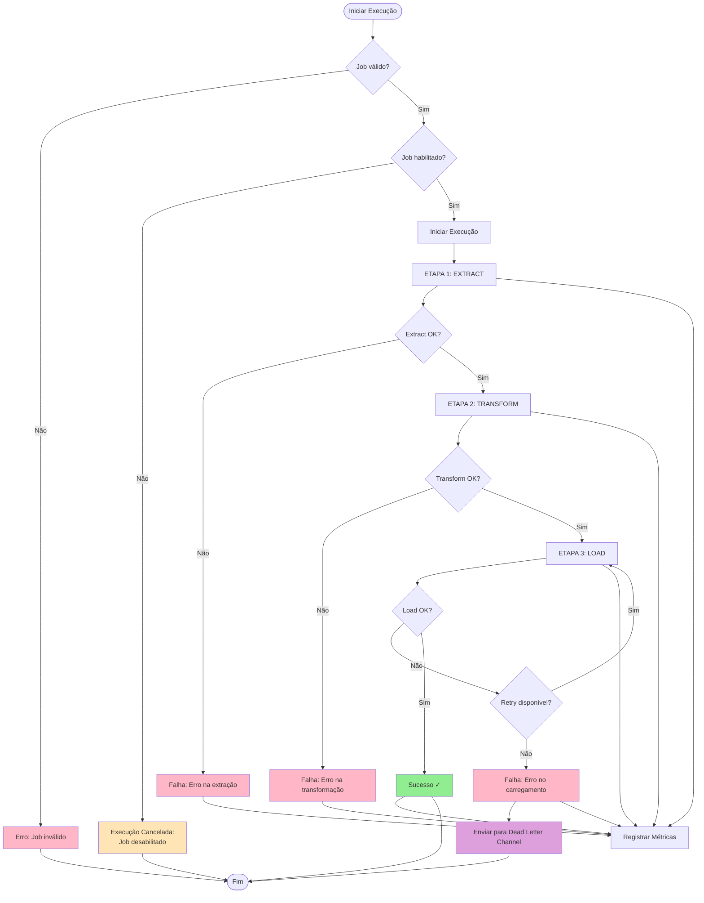

---

## 🔌 9. Gerenciamento de Conexões

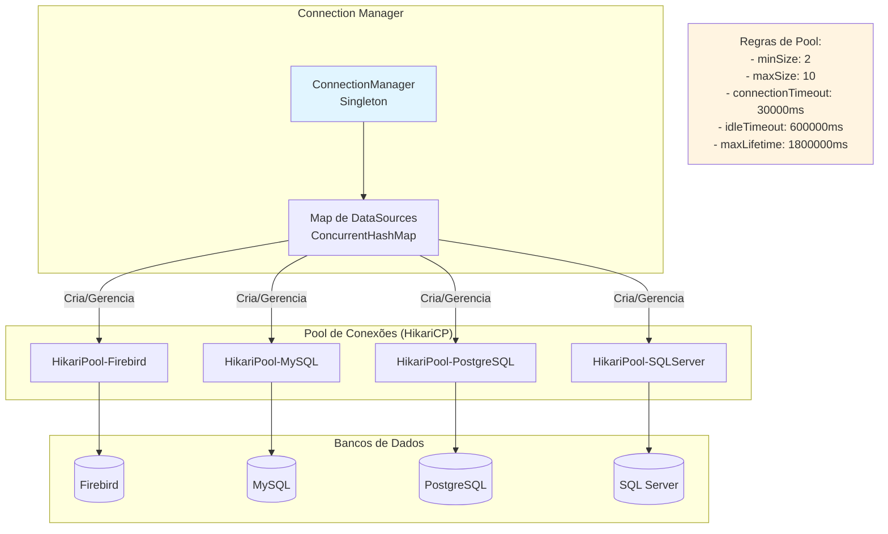

---

## 📋 10. Regras de Negócio - Lista Detalhada

### 10.1. Regras de Validação de Job

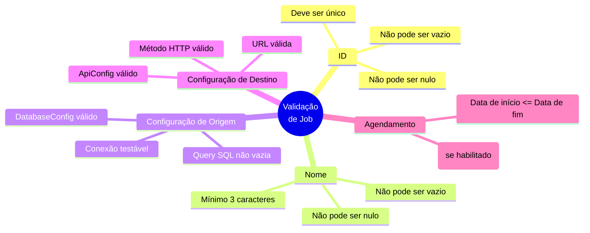

### 10.2. Regras de Execução

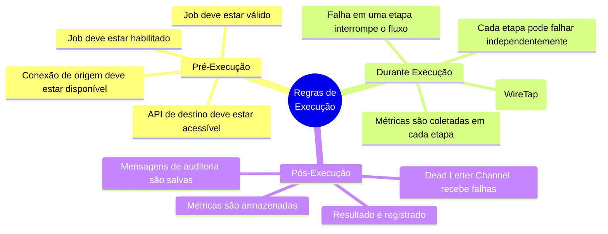

### 10.3. Regras de Transformação

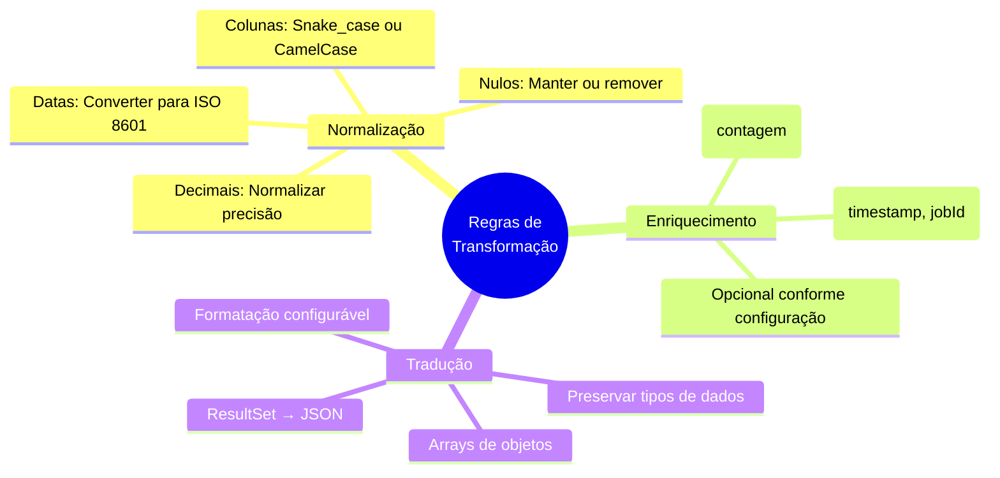

### 10.4. Regras de Tratamento de Erro

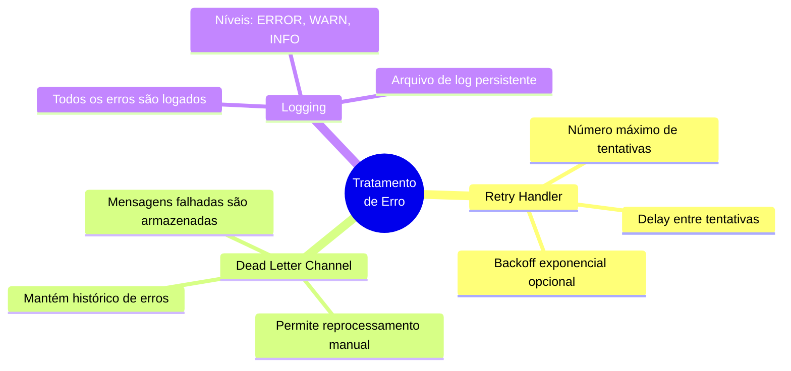

---

## 🗄️ 11. Persistência de Dados

```mermaid
graph LR
    subgraph "Configurações (JSON)"
        Jobs[config/jobs.json<br/>- EtlJob[]]
        Connections[config/connections.json<br/>- DatabaseConfig[]]
        Apis[config/apis.json<br/>- ApiConfig[]]
    end

    subgraph "Dados Temporários"
        MessageStore[data/message-store/<br/>*.json<br/>Mensagens interceptadas]
        DeadLetter[data/dead-letter/<br/>*.json<br/>Mensagens falhadas]
        Logs[logs/<br/>etl-application.log<br/>Logs do sistema]
    end

    subgraph "Serviços de Configuração"
        JobService[JobConfigService]
        ConnectionService[ConnectionConfigService]
        ApiService[ApiConfigService]
    end

    JobService --> Jobs
    ConnectionService --> Connections
    ApiService --> Apis
    WireTap --> MessageStore
    DeadLetterChannel --> DeadLetter
    LogAppender --> Logs
```

---

## 🎛️ 12. Agendamento de Jobs

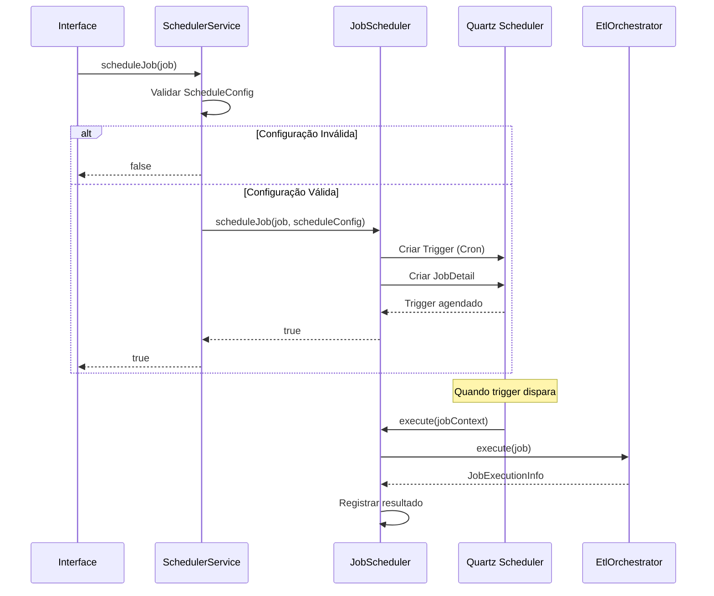

---

## 📊 13. Monitoramento e Métricas

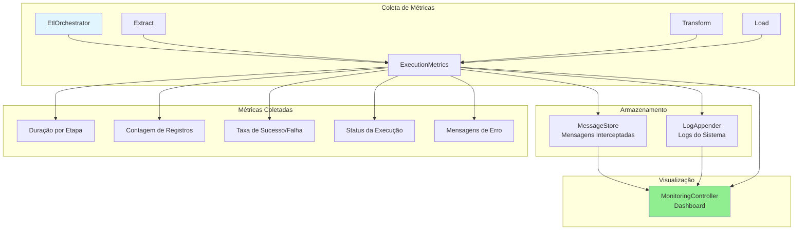

---

## 🔒 14. Autenticação em APIs

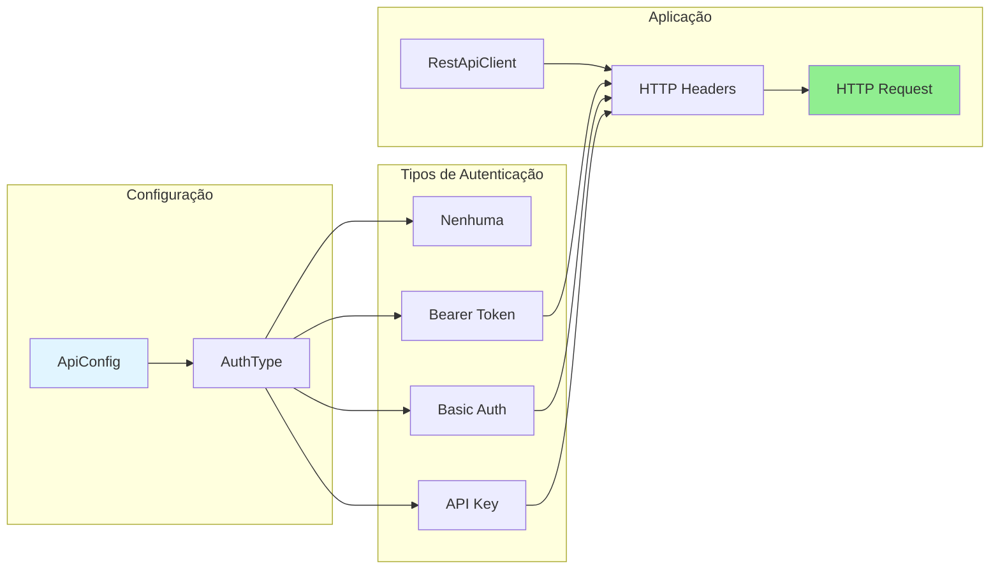

---

## 📝 Resumo das Regras de Negócio

### Regras de Validação

1. **Job ETL deve ser válido antes da execução:**
   - ID obrigatório e não vazio
   - Nome obrigatório e não vazio
   - Configuração de origem (DatabaseConfig) válida
   - Query SQL obrigatória e não vazia
   - Configuração de destino (ApiConfig) válida

2. **Job deve estar habilitado para executar:**
   - Jobs desabilitados não são executados
   - Status é verificado antes de iniciar execução

### Regras de Execução

3. **Fluxo ETL é sequencial:**
   - Extract → Transform → Load
   - Falha em qualquer etapa interrompe o fluxo
   - Métricas são coletadas em cada etapa

4. **Tratamento de erros:**
   - Retry automático configurável (LoadService)
   - Dead Letter Channel para mensagens falhadas
   - Logs detalhados de todas as operações

### Regras de Conexão

5. **Pool de conexões:**
   - Uma conexão por DatabaseConfig
   - Pool gerenciado pelo HikariCP
   - Validação automática de conexões

6. **Reutilização de conexões:**
   - DataSources são reutilizados
   - Conexões são obtidas do pool
   - Fechamento automático após uso

### Regras de Transformação

7. **Pipeline de transformação:**
   - Normalização obrigatória
   - Enriquecimento opcional
   - Tradução para JSON obrigatória

8. **Interceptação de mensagens:**
   - WireTap intercepta todas as mensagens
   - Mensagens são armazenadas para auditoria
   - Monitoramento em tempo real

### Regras de Agendamento

9. **Agendamento de jobs:**
   - Expressões Cron válidas
   - Jobs podem ser pausados/retomados
   - Agendamento independente da execução manual

---

**Última atualização:** Baseado no código-fonte atual do projeto PlugWay ETL

